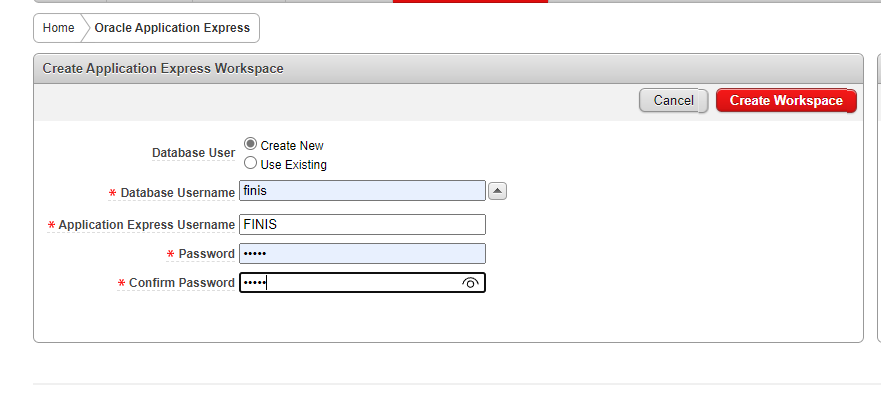
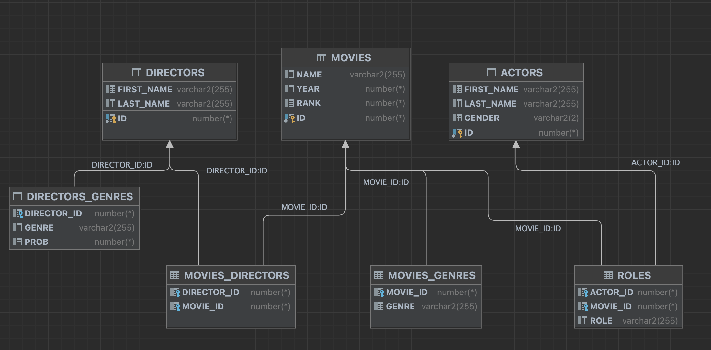

## SQL en Base de Datos Oracle Docker para macOS

### Descripción

Se integra Oracle Database con Docker en macOS, especialmente en dispositivos con procesadores M1, utilizando Colima para facilitar la compatibilidad con ARM. Nos centramos en implementar, gestionar y optimizar consultas SQL en Oracle, utilizando el conjunto de datos IMDb del Repositorio de Conjuntos de Datos Relacionales. El objetivo es analizar el rendimiento de las consultas SQL con diferentes volúmenes de datos, destacando la importancia de la optimización en bases de datos de gran tamaño.

### Requisitos

- Oracle Express Edition (Imagen Docker)
- Docker (para usuarios de macOS)
- DataGrip o SQL Developer IDE


### Base de datos

Relational Dataset Repository: https://relational.fit.cvut.cz/dataset/IMDb

Name : IMdb

Description : Moderately large, real database of movies

Size : 5.694.919 data

Tables : 7

IDE THAT WAS USED (SQL): DataGrip 

### Instalacion y coneccion en macOS


```bash

# Hemebrew - Package Manager for Macos

# Install Docker - is an open source platform for building, deploying, and managing containerized applications

`brew install docker`

# Install - Container runtimes on macOS

`brew install colima` 

# Start Colima

`colima start --arch x86_64 --memory 4` 

# Oracle Express Edition 11g Release 2 on Ubuntu 18.04 LTS

`git clone https://github.com/wnameless/docker-oracle-xe-11g.git`

`cd docker-oracle-xe-11g`

`docker build -t wnameless/oracle-xe-11g`

`docker run -d -p 49161:1521 wnameless/oracle-xe-11g-r2`

# Inicializar docker imagen

`docker start [IMAGEN]`

```

### Descripcion Archivos

`createUser.sql`

Este archivo se encarga de la creación del usuario en la base de datos Oracle. Es esencial para establecer los privilegios y el entorno de trabajo necesario para las operaciones de la base de datos.

`DDL.sql`

Contiene las instrucciones de Definición de Datos (DDL) para la construcción de la base de datos. Aquí se crean todas las tablas requeridas, definiendo su estructura y las relaciones entre ellas.

`queries.sql`

Este archivo alberga una variedad de consultas SQL para interactuar con la base de datos IMDb. Incluye desde consultas simples para una tabla hasta consultas avanzadas que implican múltiples tablas, uso de GROUP BY, y condiciones variadas. Se diseñó para extraer información específica como nombres y años de películas, detalles de actores y directores, y análisis por géneros y rankings.

`rangeQueries.sql`

Incluye la creación de vistas para manejar diferentes rangos de datos, utilizando la función DBMS_RANDOM.RANDOM para generar muestras aleatorias de varias tablas. Este archivo es clave para evaluar el rendimiento de las consultas SQL con distintos tamaños de datos y simular escenarios de bases de datos más complejos, incluyendo ejemplos de inserción de datos y creación de tablas para clientes, empleados, productos, pedidos y ventas.

### Login



### Visualización Gráfica de la Base de Datos



### Tablas


